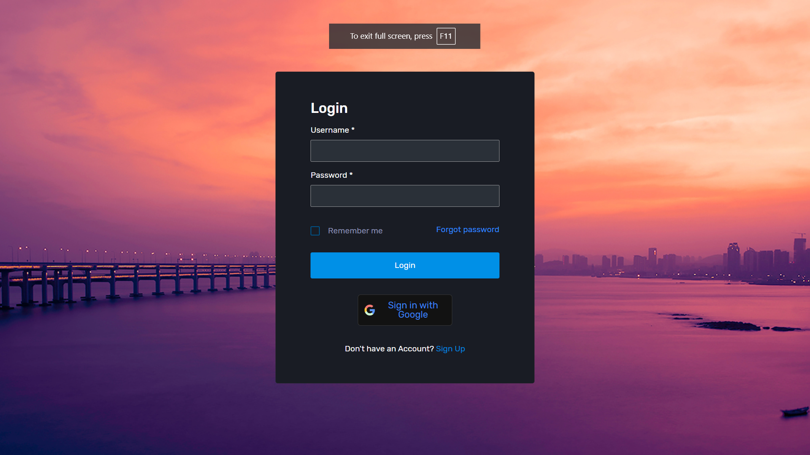
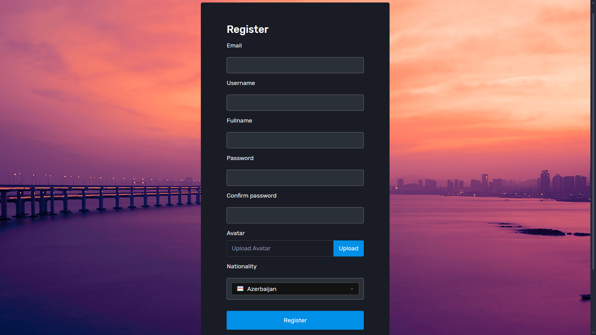
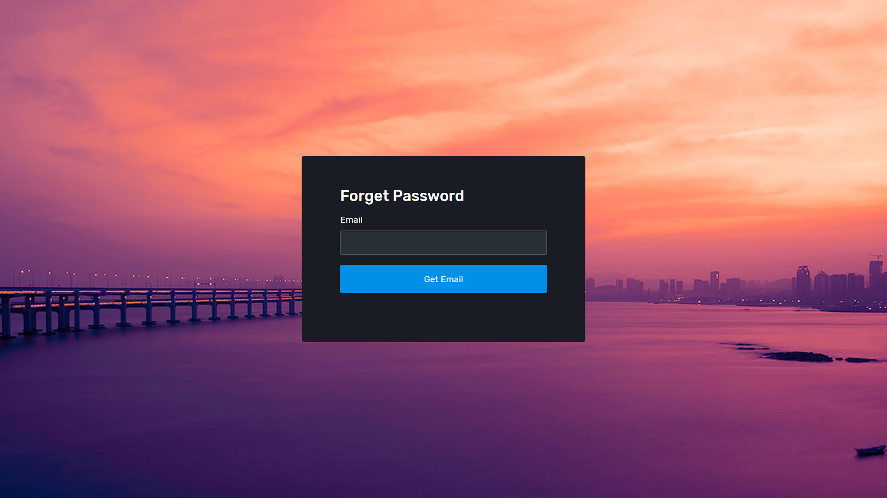
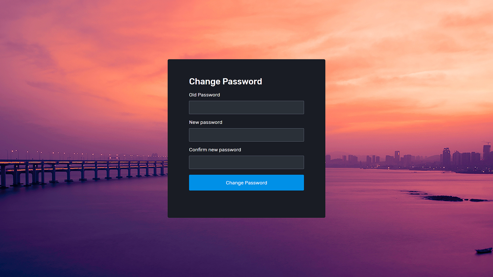
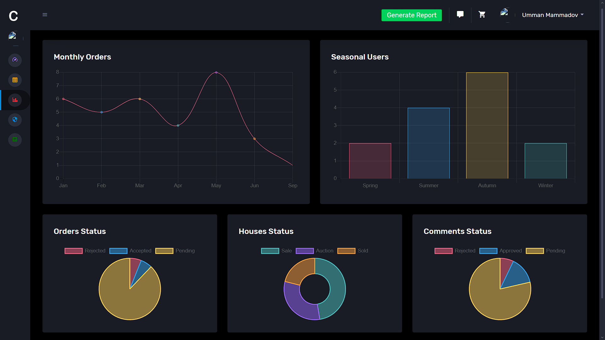
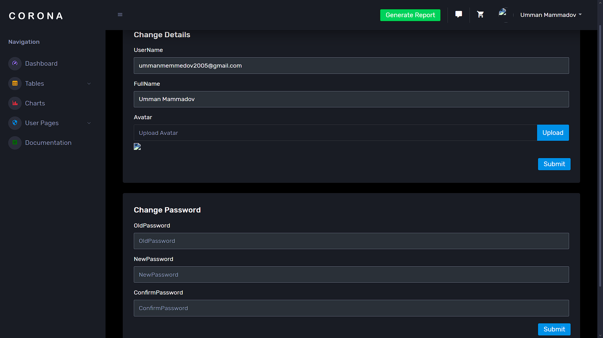
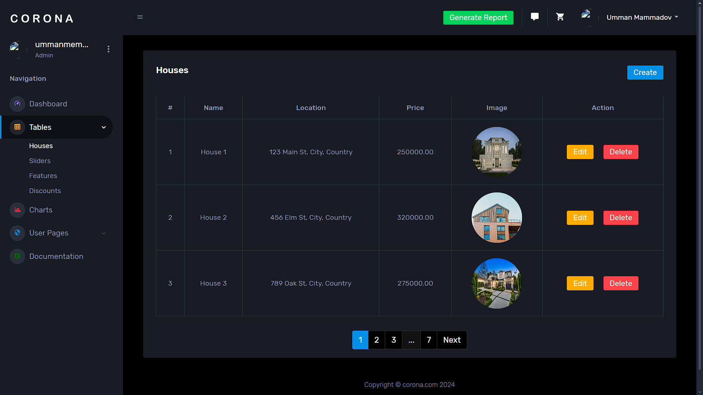
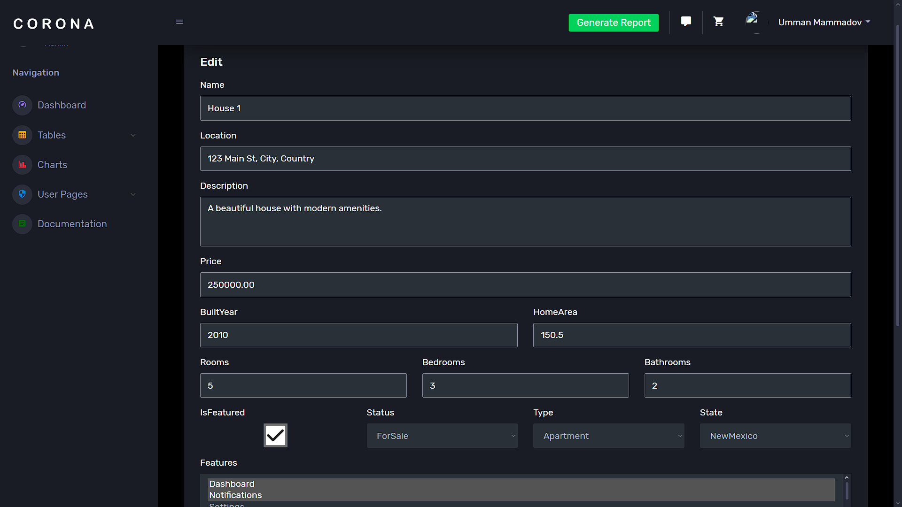

# Quarter Real Estate


## Description

This project contains 3 main project.

- ASP.NET Web API for Clients and Admin.
- ASP.NET MVC for Admin dashboard.
- Docker Compose to easily run locally and deploy to the cloud services.

### Features

- **Three Role**: Member, Admin, SuperAdmin.
- **Property Management API**: Simplifies integration with the Quarter real estate.
- **Dynamic Listings**: Provides endpoints to fetch, create, update, and delete property listings.
- **Search Functionality**: Supports filtering properties by price, location, type, and other attributes.
- **Authentication**: Secure user authentication and role-based access.
- **Favorites System**: Allows users to save and manage their favorite listings.
- **Client UI**: Profile update, Live auctions, Promo codes, Stripe payment.
- **Admin Dashboard**: Elegant UI to administrate all functionality like estates, sliders, discounts, orders, comments. Listing users and admins (only SuperAdmin), Creating Admin (only SuperAdmin), Excel reporting and so on.
- **Unique Features**: Background jobs with Hangfire, Real-Time payment with Stripe, CI/CD with CircleCI

---

## Table of Contents

- [Quarter Real Estate](#quarter-real-estate)
  - [Description](#description)
    - [Features](#features)
  - [Table of Contents](#table-of-contents)
  - [Getting Started](#getting-started)
    - [Prerequisites](#prerequisites)
    - [Installation](#installation)
    - [Deployment](#deployment)
  - [Technologies Used](#technologies-used)
  - [Screenshots](#screenshots)
  - [License](#license)
  - [Contributing](#contributing)
  - [Contact](#contact)

---

## Getting Started

### Prerequisites

List all software and tools required to run or develop the project, e.g.,

- .NET SDK 8.0
- Microsoft SQL Server 19+
- Docker & Docker Compose
- Google Cloud Account
- Redis

### Installation

Step-by-step instructions for setting up the project locally and with Docker:

1. Local

   1. Clone the repository:

   ```bash
   git clone https://github.com/UMMANCODE/FINAL.git
   ```

   2. Navigate to the project directory:

   ```bash
   cd FINAL
   ```

   3. Set up environment variables in `appsettings.Development.json` file.

   4. Run the application:

   ```bash
   dotnet run
   ```

2. Docker

   1. Clone the repository:

   ```bash
   git clone https://github.com/UMMANCODE/FINAL.git
   ```

   2. Navigate to the project directory:

   ```bash
   cd FINAL
   ```

   3. Set up environment variables in `docker-compose.override.yml` file.

   4. Run the application:

   ```bash
   docker-compose -d up
   ```

### Deployment

Deployment is really simple with CI/CD pipeline:

1. Just create a new account on CircleCI.
2. Add environment variables.
3. Create a compute engine on GCP.
4. Access to the API and Dashboard.

---

## Technologies Used

- **Frontend**: HTML, CSS, JS, Bootstrap, JQuery
- **Backend**: C#, .NET, Entity Framework
- **Libraries**: Hangfire, SignalR, REST, XUnit,FluentAPI, Seq, Google Oauth2, Stripe
- **Database**: MSSQL, Redis
- **Tools**: Docker, Docker Compose, CircleCI

---

## Screenshots










---

## License

This project is licensed under the [MIT License](LICENSE). See the LICENSE file for details.

---

## Contributing

Contributions are welcome! Follow these steps to contribute:

1. Fork the repository.
2. Create a new branch:

   ```bash
   git checkout -b feature/your-feature-name
   ```

3. Commit your changes:

   ```bash
   git commit -m "Add your message here"
   ```

4. Push to the branch:

   ```bash
   git push origin feature/your-feature-name
   ```

5. Open a pull request.

---

## Contact

- **Name**: Umman Mammadov
- **Email**: [ummanmemmedov2005@gmail.com](mailto:ummanmemmedov2005@gmail.com)
- **LinkedIn**: [LinkedIn](https://www.linkedin.com/in/umman-mammadov)

---
